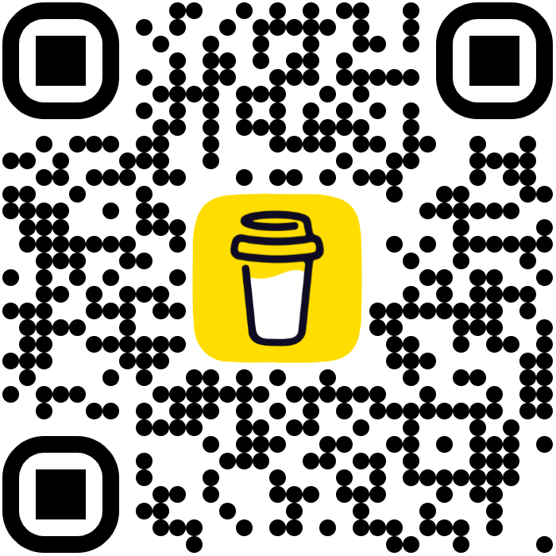

  

# Ateljé Vagabond

**Cloud FinOps · Data Engineering · Edge AI · Precision Metalcraft**

*Landskrona, Sweden*

---

## About the Studio

Ateljé Vagabond is a multidisciplinary engineering studio with over 20 years of hands-on expertise in distributed systems, cloud infrastructure, and embedded AI. We architect scalable ETL/ELT data pipelines, deploy Edge AI on constrained hardware, and drive FinOps transformations that measurably reduce cloud spend — while our physical craft arm delivers custom precision metalwork and ruggedized hardware for field deployments.

We operate from Landskrona, Sweden, where STM32 development boards sit next to antique gravers, and FinOps dashboards are open on the same workbench as titanium stock. We write firmware, architect cloud data pipelines, and hand-finish metal — because the problems we find most compelling live at exactly the boundary between software intelligence and the physical world.

---

## What We Build

| Area | Description |
|---|---|
| **Data Engineering & Cloud FinOps** | Scalable ETL/ELT pipelines, FinOps cost optimization, and cloud infrastructure engineered for production scale |
| **Edge AI & Embedded Systems** | ESP32-based field deployments, autonomous sensors, and intelligent hardware |
| **Creative Electronics** | Playful low-power builds, circuits, and interactive pieces |
| **Metal Engraving & Electro-Etching** | Custom plates, deep textures, and precision work for objects, gifts, and art |
| **Design** | Concept work for brands, makers, and creative projects |
| **Restoration** | Renewing the life and stories within meaningful objects and artworks *(coming soon)* |

We do not take mass orders. Every project demands time and focus.

---

## STANCE — Our Manifesto

**S — Sustainability**
What we build must matter and respect the world it enters. We evaluate impact, energy efficiency, repairability, and longevity.

**T — Thoughtfulness**
We do not create because we can. We build with intention, restraint, and clarity of purpose.

**A — Augmentation**
AI and modern tools expand our capacity to think, learn, and create. Technology is a multiplier, not a replacement for human judgment.

**N — Necessity**
A product must serve a real need, without excess or spectacle. Resource use must always be justified.

**C — Craft**
Quality is the baseline. Security, durability, engineering clarity, and honest workmanship guide everything we build.

**E — Ethics**
We share openly when it benefits the community, and we protect what must remain private. Responsibility defines our boundaries.

---

## Why Vagabond?

Because craft should never stand still.

We work in the space between ancient metalwork, digital design, and modern electronics, letting each discipline push the others forward. A vagabond is not rootless. A vagabond explores — a refusal to settle into one craft, one tradition, one identity. So do we.

Every project is a crossing, a dialogue between worlds that were never meant to touch but become something new together. We wander through techniques, borrowing from chemistry, engraving, coding, and design. The work becomes a journey — from pixel to metal, from idea to object, from past to future.

We believe the objects you carry should hold weight, memory, and story. That is why we create.

---

## Fuel the Workshop

<table>
<tr>
<td width="72%">

Some projects begin with a sketch. Others begin with a failing test, an ESP32 on the bench, or a piece of metal waiting for its next life. Coffee tends to be present for all of them.

If our open-source work saved you an afternoon, helped a device ship, or sparked an experiment of your own, you can help keep the next build moving.

</td>
<td width="28%" align="center">

Scan to support the next experiment.

</td>
</tr>
</table>

---

**hej@ateljevagabond.se** · Landskrona, Sweden

*A small studio. A small list. The right people.*

